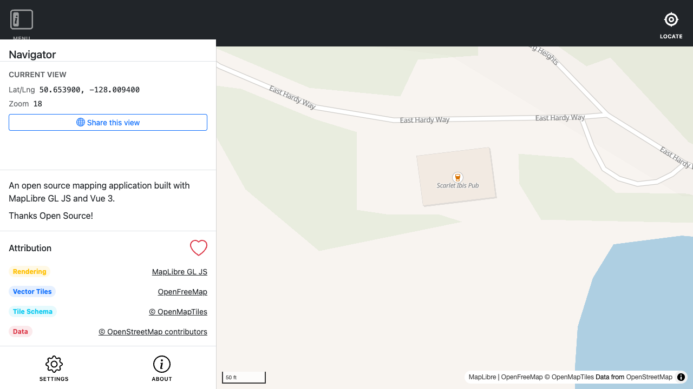

# Navigator

A free, Open-Source navigation app for the real world.

[Use Navigator](https://www.ogis.org/navigator/)

[](https://www.ogis.org/navigator/)

## Thanks Open Source!

| Component          | Source                                                                                                            |
| ------------------ | ----------------------------------------------------------------------------------------------------------------- |
| **Map Data**       | &copy; [OpenStreetMap contributors](https://www.openstreetmap.org/copyright)                                      |
| **Tile Hosting**   | [OpenFreeMap](https://openfreemap.org)                                                                            |
| **Rendering**      | [MapLibre GL JS](https://maplibre.org/)                                                                           |
| **Tile Schema**    | [OpenMapTiles](https://www.openmaptiles.org/) / [OSM Bright](https://github.com/openmaptiles/osm-bright-gl-style) |
| **User Interface** | [Vue JS](https://vuejs.org/) / [Bootstrap](https://getbootstrap.com/)                                             |

## Install

Navigator is [available on npm](https://www.npmjs.com/package/@ogis/navigator) as `@ogis/navigator`. It can be installed with:

```bash
npm install @ogis/navigator
```

## Usage

```js
import Navigator from "@ogis/navigator";
import "@ogis/navigator/navigator.css";

Navigator.init({ id: "my-map" });
```

`Navigator.init()` looks for a `<div id="my-map">` in the DOM. If one does not exist it is created and appended to `<body>`.

### Options

```js
Navigator.init({
  id: "my-map", // DOM element id to mount into (created if absent); defaults to 'navigator'
  locale: "fr", // default language; uses browser language if omitted
  messages: {   // override any UI label for any language
    en: { "about.title": "My Map" },
    fr: { "about.title": "Ma carte" },
  },
  mapOptions: {
    // passed directly to the MapLibre Map constructor
    center: [-128.0094, 50.6539],
    zoom: 12,
  },
});
```

See [`docs/config.md`](docs/config.md) for the full configuration reference.

### Multiple instances

Each call to `Navigator.init()` creates a fully isolated instance with its own map, UI state, and localStorage namespace.

```js
  Navigator.init({ id: 'map-a', mapOptions: { center: [-128.0094, 50.6539], zoom: 10 } });
  Navigator.init({ id: 'map-b', mapOptions: { center: [-128.0094, 50.6539], zoom: 14 } });
```

See [`docs/instances.md`](docs/instances.md) for full details.

## Development

### Document First

Navigator follows a **Document First** development process. Before writing any code, write the documentation for what you're building. Tests and implementation follow from that.

```
Document → Test → Implement → Screenshot
```

**1. Write the documentation** — Start by writing (or updating) the relevant `docs/` file. Describe what the feature does, how to use it, and what developers can expect. If you can't explain it, it probably isn't ready to build.

**2. Write the tests** — Translate each doc heading into a `test.describe` block in the corresponding spec file. If you can't write a test for something, the docs description is too vague — sharpen it first.

**3. Implement until the tests pass** — The docs and tests define the target; the implementation just needs to reach it. Run `npm test -- tests/e2e/{relevant}.spec.js` to track progress. See [docs/testing.md](docs/testing.md) for how to find the right spec.

**4. Add screenshots to the docs** — For sections where a picture helps, add a screenshot spec in `tests/e2e/screenshots/` and embed the output in the docs. Not every section needs one.

See [docs/testing.md](docs/testing.md) for the full testing and screenshot strategy.

### Install

```bash
npm install
```

### Run

```bash
npm run dev
```

### Test

```bash
npm test -- tests/e2e/{spec}.spec.js
```

See [docs/testing.md](docs/testing.md) for the testing strategy and how to find the right spec file.

### Build

```bash
npm run build
```
