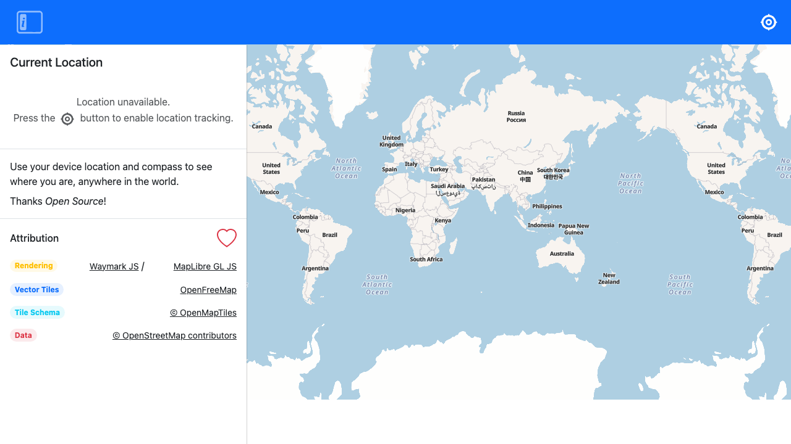

# Navigator

Use your device location and compass to see where you are, anywhere in the world.



Thanks Open Source!

**Rendering** [MapLibre GL JS](https://maplibre.org/) / [Waymark JS](https://github.com/OpenGIS/Waymark-JS)

**Vector Tiles** [OpenFreeMap](https://openfreemap.org)

**Tile Schema** [OpenMapTiles](https://www.openmaptiles.org/)

**Data** [OpenStreetMap contributors](https://www.openstreetmap.org/copyright)

## Development

### Install

```bash
npm install
```

### Run

```bash
npm run dev
```

### Test

```bash
npm test
```

### Build

```bash
npm run build
```
