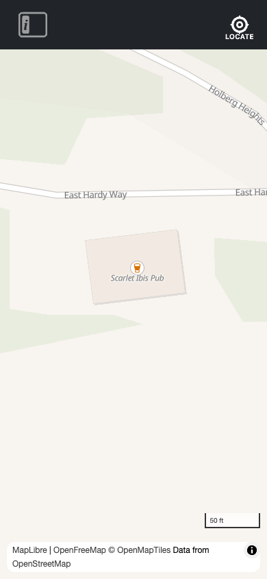

# Core — Map & UI

The core module provides two composables that every part of the application is built on: `useMap` for MapLibre lifecycle management and `useUI` for application UI state. Both are instance-aware — they scope their state to the active Navigator instance via `inject('navigatorId')`.

---

## URL hash — map view sharing

Navigator reads and writes the map view to the URL hash in [OpenStreetMap format](https://wiki.openstreetmap.org/wiki/Browsing#Linking_to_a_specific_location):

```
#map={zoom}/{lat}/{lng}
```

Example: `#map=18/50.653900/-128.009400`

### Initial view from URL

If the URL contains a `#map=…` hash on page load, Navigator uses it as the initial map view — taking priority over any previously persisted view. This lets you share a specific location by URL.

### Keeping the hash in sync

As the map is panned or zoomed, the URL hash is updated automatically (throttled to once per second, matching the localStorage persistence interval). The hash and the persisted view are always kept in sync.

### Share link in the menu

The navigation menu panel displays the current map coordinates and zoom level, and a **Share this view** link. Clicking the link opens the current map view in a new tab, or you can copy the URL to share a specific location.

The **Current view** section is hidden on a true first visit (no URL hash, no persisted view). It appears as soon as a view is available — either because the page loaded with a `#map=…` hash, the user has a previously saved view, or the map has been panned or zoomed.


---

## `useMap` — `src/core/useMap.js`

Manages the MapLibre GL JS map lifecycle: creation, view persistence, and cleanup.

### Initialising the map

Call `useMap` with a Vue template ref from the component that owns the map container. This is done once, in `App.vue`.

```js
import { ref } from 'vue';
import { useMap } from '@/core/useMap';

const mapContainer = ref(null);
useMap(mapContainer, mapOptions);
```

```html
<div ref="mapContainer" class="navigator-map" />
```

Internally, `useMap` registers `onMounted` and `onUnmounted` hooks. On mount, a `maplibregl.Map` is created with the OpenFreeMap bright style as the default. On unmount, the map is destroyed and the instance cache is cleared.

### Accessing the map instance

Call `useMap()` without arguments from any component or feature composable to retrieve the current map instance.

```js
import { useMap } from '@/core/useMap';

const { map } = useMap();
if (map) {
  map.addSource('my-source', { type: 'geojson', data: { ... } });
}
```

> **Note:** `map` is `null` until the MapLibre `load` event has fired. Features that add sources or layers must guard against this or be triggered by user interaction (which always happens after load).

### View persistence

The current map center and zoom are automatically saved to `localStorage` under the key `navigator_view_{instanceId}` after every map movement (throttled to once per second). On the next load, the saved view is restored via `map.jumpTo()`.

This is the same key `useUI` checks for `isFirstLoad` — the presence of this key signals that the user has visited before.

### `mapOptions`

Any [MapLibre `MapOptions`](https://maplibre.org/maplibre-gl-js/docs/API/type-aliases/MapOptions/) passed to `Navigator.init()` are forwarded to the `Map` constructor and merged with the defaults:

```js
{
  style: 'https://tiles.openfreemap.org/styles/bright',
  attributionControl: true,
  // ...mapOptions spread here
}
```

### Returned API

```js
const { map } = useMap();
```

| Property | Type | Description |
|----------|------|-------------|
| `map` | `maplibregl.Map \| null` | The active MapLibre map instance, or `null` before load |

---

## `useUI` — `src/core/useUI.js`

Manages all application UI state: responsive breakpoints, the navigation sidebar, and the side panel.

### Usage

Call `useUI()` from any component's `setup` to access state and actions. State is shared across all components within the same Navigator instance.

```js
import { useUI } from '@/core/useUI';

const { isDesktop, isPanelVisible, openPanel, togglePanel } = useUI();
```

### Responsive breakpoints

`useUI` tracks `window.innerWidth` via a single resize listener (registered once per instance) and exposes three computed breakpoint flags.

| Computed | Type | Condition |
|----------|------|-----------|
| `isDesktop` | `boolean` | `width >= 992px` |
| `isTablet` | `boolean` | `768px ≤ width < 992px` |
| `isMobile` | `boolean` | `width < 768px` |

On resize, `isNavVisible` is automatically managed: it is forced `true` on desktop and hidden on smaller screens if the nav was not explicitly expanded.



### Panel

The side panel displays a single active Vue component at a time. Features open the panel by passing their panel component to `openPanel` or `togglePanel`.

#### `openPanel(id, component)`

Opens the panel with the given component. Closes the mobile nav if open.

```js
import MyPanel from '@/features/my-feature/panel.vue';

openPanel('my-feature', MyPanel);
```

#### `togglePanel(id, component)`

Toggles the panel for the given id:
- If the panel is already open with the same id, it is closed.
- If a different id is provided, the panel switches to the new component.
- On mobile, always opens (never toggles closed).

```js
// Typically called from a top-bar button
togglePanel('my-feature', MyPanel);
```

#### `closePanel()`

Closes the panel without changing the active component.


### First load

`isFirstLoad` is `true` when the instance has no persisted map view in `localStorage` (i.e. the user has never visited before with this instance id). It becomes `false` once the map is moved (the view storage key is written) or when `setFirstLoadComplete()` is called explicitly.

```js
const { isFirstLoad, setFirstLoadComplete } = useUI();

// Dismiss the first-load alert manually
setFirstLoadComplete();
```


### Full API

#### State (refs)

| Name | Type | Description |
|------|------|-------------|
| `width` | `number` | Current `window.innerWidth` |
| `isFirstLoad` | `boolean` | `true` on the user's first visit |
| `isNavVisible` | `boolean` | Whether the navigation sidebar is visible |
| `isNavExpanded` | `boolean` | Whether the nav is in expanded mode |
| `isPanelVisible` | `boolean` | Whether the side panel is open |
| `isPanelExpanded` | `boolean` | Whether the panel is in expanded mode |
| `activePanelId` | `string \| null` | The id of the currently active panel |
| `activePanelComponent` | `Component \| null` | The Vue component rendered in the panel |

#### Computed

| Name | Type | Description |
|------|------|-------------|
| `isDesktop` | `boolean` | `width >= 992px` |
| `isTablet` | `boolean` | `768px ≤ width < 992px` |
| `isMobile` | `boolean` | `width < 768px` |

#### Actions

| Name | Signature | Description |
|------|-----------|-------------|
| `openPanel` | `(id, component)` | Open panel with given component |
| `togglePanel` | `(id, component)` | Toggle panel open/closed or switch component |
| `closePanel` | `()` | Close the panel |
| `togglePanelExpanded` | `()` | Toggle panel expanded state |
| `setPanelExpanded` | `(value)` | Set panel expanded state directly |
| `toggleNav` | `()` | Toggle navigation sidebar |
| `closeNav` | `()` | Close navigation sidebar |
| `setNavExpanded` | `(value)` | Set nav expanded state directly |
| `setFirstLoadComplete` | `()` | Manually mark first load as complete |
