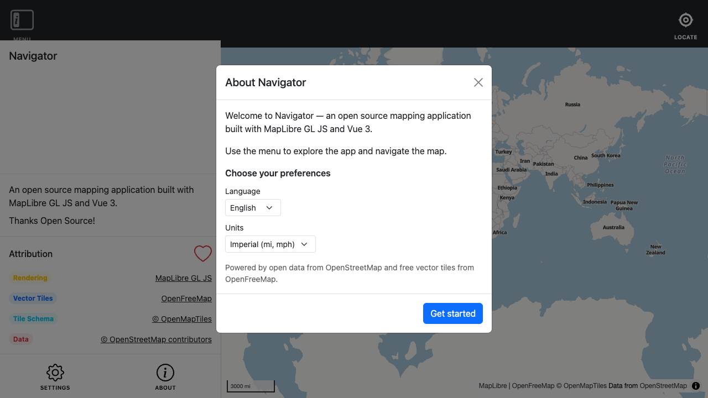

# Core

The core module provides three composables that every part of the application is built on. All are instance-aware — they scope their state to the active Navigator instance via `inject('navigatorId')`.

- **[`useMap`](map.md)** — MapLibre GL JS lifecycle management: map creation, view persistence, and URL hash sync.
- **[`useUI`](ui.md)** — Application UI state: responsive breakpoints, the navigation sidebar, and the side panel.
- **[`useLocale`](locale.md)** — Multi-language support: browser-language detection, translation lookup, and locale persistence.

---

## First load

`isFirstLoad` is `true` when the instance has no persisted map view in `localStorage` (the user has never visited before with this instance id). It becomes `false` once the map is moved (the view storage key is written) or when `setFirstLoadComplete()` is called explicitly.

### Welcome modal

On the first visit, a **Welcome modal** is shown. It lets the user choose their preferred language and units before they begin exploring the map.



### Language

The language selector defaults to the browser language if it is supported, or English otherwise. Changing the selection takes effect immediately — the modal itself re-renders in the chosen language. The choice is saved to the settings store and persists across reloads.

### Units

The units selector defaults based on the browser locale: **imperial** for US, Liberia, and Myanmar; **metric** for all other regions. The choice is saved to the settings store and persists across reloads.

### Returning visits

On returning visits the Welcome modal is not shown — the user's stored language and units preferences are applied automatically.

### About button

The modal can be re-opened at any time via the **About** button in the navigation menu.

### API

```js
const { isFirstLoad, showAboutModal, openAboutModal, closeAboutModal, setFirstLoadComplete } = useUI();
```

| Name | Type | Description |
|------|------|-------------|
| `isFirstLoad` | `ref<boolean>` | `true` on the user's first visit |
| `showAboutModal` | `ref<boolean>` | Whether the Welcome modal is visible |
| `openAboutModal()` | action | Opens the Welcome modal |
| `closeAboutModal()` | action | Closes the modal and marks first load complete |
| `setFirstLoadComplete()` | action | Marks first load complete without opening the modal |
