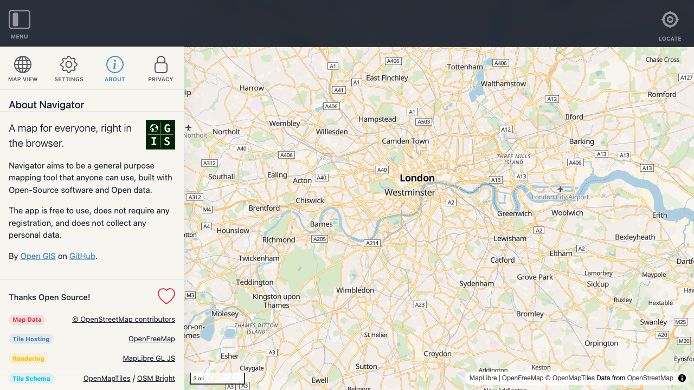
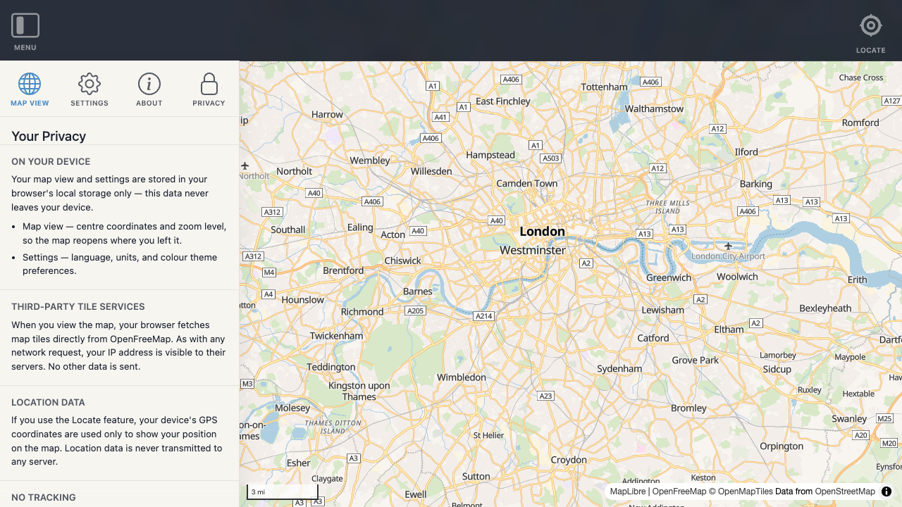

# Core

The core module provides three composables that every part of the application is built on. All are instance-aware — they scope their state to the active Navigator instance via `inject('navigatorId')`.

- **[`useMap`](../dev/map.md)** — MapLibre GL JS lifecycle management: map creation, view persistence, and URL hash sync.
- **[`useUI`](../dev/ui.md)** — Application UI state: responsive breakpoints, the navigation sidebar, and the side panel.
- **[`useLocale`](../dev/locale.md)** — Multi-language support: browser-language detection, translation lookup, and locale persistence.

---

## First load

`isFirstLoad` is `true` when the instance has no persisted map view in `localStorage` (the user has never visited before with this instance id). It becomes `false` once the map is moved (the view storage key is written) or when `setFirstLoadComplete()` is called explicitly.

### Welcome modal

On the first visit, a **Welcome modal** is shown. It lets the user choose their preferred language and units before they begin exploring the map.


### Language

The language selector defaults to the browser language if it is supported, or English otherwise. Changing the selection takes effect immediately — the modal itself re-renders in the chosen language. The choice is saved to the settings store and persists across reloads.

### Units

The units selector defaults based on the browser locale: **imperial** for US, Liberia, and Myanmar; **metric** for all other regions. The choice is saved to the settings store and persists across reloads.

### Returning visits

On returning visits the Welcome modal is not shown — the user's stored language and units preferences are applied automatically.

### About button

The **About** button in the navigation menu opens the [About panel](#about-panel), which provides app information and attribution.

### API

```js
const { isFirstLoad, showAboutModal, openAboutModal, closeAboutModal, setFirstLoadComplete } = useUI();
```

| Name | Type | Description |
|------|------|-------------|
| `isFirstLoad` | `ref<boolean>` | `true` on the user's first visit |
| `showAboutModal` | `ref<boolean>` | Whether the Welcome modal is visible |
| `openAboutModal()` | action | Opens the Welcome modal |
| `closeAboutModal()` | action | Closes the modal and marks first load complete |
| `setFirstLoadComplete()` | action | Marks first load complete without opening the modal |

---

## About panel

The **About panel** is accessible at any time via the **About** button in the navigation menu. It provides a short description of Navigator and attribution for the open-source components it is built on.

### Description

The panel displays a brief introduction to Navigator.

### Attribution

The attribution table lists every open-source component and data source Navigator depends on, matching the **Thanks Open Source!** section in the README.

| Component | Source |
|-----------|--------|
| **Map Data** | © [OpenStreetMap contributors](https://www.openstreetmap.org/copyright) |
| **Tile Hosting** | [OpenFreeMap](https://openfreemap.org) |
| **Rendering** | [MapLibre GL JS](https://maplibre.org/) |
| **Tile Schema** | [OpenMapTiles](https://www.openmaptiles.org/) / [OSM Bright](https://github.com/openmaptiles/osm-bright-gl-style) |
| **User Interface** | [Vue JS](https://vuejs.org/) / [Bootstrap](https://getbootstrap.com/) |



---

## Privacy panel

The **Privacy panel** is accessible at any time via the **Privacy** button in the navigation menu (located before the About button). It explains what data Navigator stores, what third-party services are contacted, and what is never collected.

### On your device

Navigator stores the following data in your browser's `localStorage` only — it never leaves your device:

- **Map view** — centre coordinates and zoom level, so the map reopens where you left it.
- **Settings** — language, units, and colour theme preferences.

### Third-party tile services

When you view the map, your browser fetches map tiles directly from [OpenFreeMap](https://openfreemap.org). As with any network request, your IP address is visible to their servers. No other data is sent. Refer to the OpenFreeMap website for their privacy policy.

### Location data

If you use the **Locate** feature, your device's GPS coordinates are used only to show your position on the map. Location data is never transmitted to any server.

### No tracking

Navigator contains no analytics, no advertising, no cookies, and no tracking scripts of any kind.


