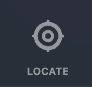
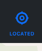
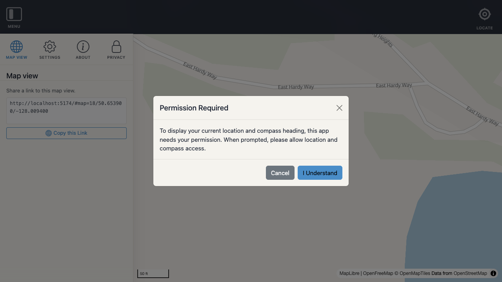
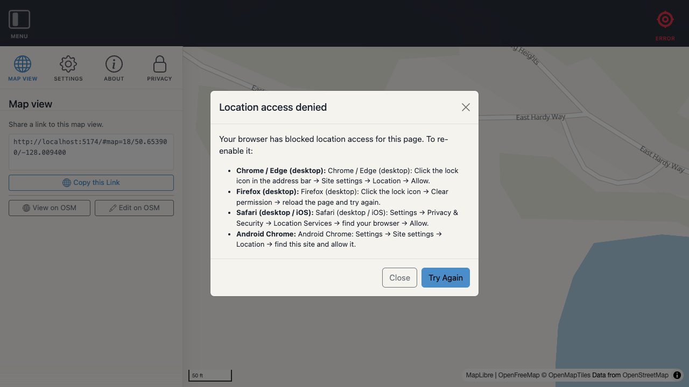
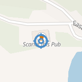
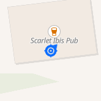
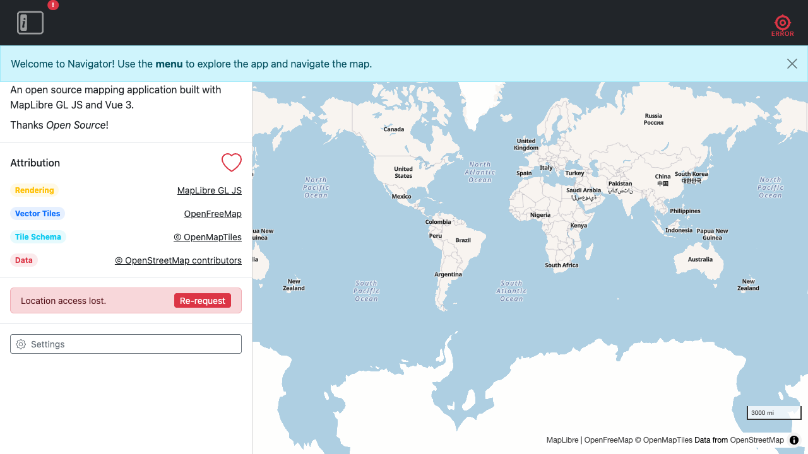

# Locate

The Locate feature shows the user's current position on the map as a live marker and optionally keeps the map centred as they move. It uses the browser [Geolocation API](https://developer.mozilla.org/en-US/docs/Web/API/Geolocation_API) and [DeviceOrientation API](https://developer.mozilla.org/en-US/docs/Web/API/DeviceOrientationEvent) for heading.

---

## Locate button

The Locate button sits in the right slot of the top navigation bar. It has four visual states that reflect the current locate mode.

| State | Icon | Label | Meaning |
|-------|------|-------|---------|
| **Inactive** | White crosshairs | Locate | Location is off |
| **Active** | Primary crosshairs | Located | Position is shown on the map; map does not follow |
| **Following** | Primary crosshairs-with-lock | Following | Position is shown and the map re-centres on every position update |
| **Error** | Error-colour crosshairs | Error | Permission was denied or a geolocation error occurred |

> Icons are sourced from the SVG sprite. Placeholder icons are used until the sprite is implemented.

| Inactive | Active | Following | Error |
|----------|--------|-----------|-------|
|  |  |  |  |

### Cycling through states

Clicking the button cycles through the active states:

```
Inactive → Active → Following → Inactive → …
```

The Error state is not part of the cycle. Clicking the Error button re-opens the [permission denied modal](#permission-denied).

---

## Initial zoom

When the Locate button is pressed and the first position fix is successfully acquired, the map flies to the user's position at **zoom 16**. This ensures the user immediately sees their precise location without needing to adjust the zoom manually.

The initial zoom fires only once per activation — on the very first fix after Locate is started. Subsequent fixes in **Active** mode do not move the map. In **Following** mode the map re-centres on every update at the current zoom level.

---

## Permission flow

Geolocation permission, once denied in a browser, is difficult to re-grant — particularly on mobile. To protect against accidental denial, the feature tracks whether the user has ever successfully shared their location, using `useStorage`.

### Storage key

```
navigator_locate_{instanceId}
```

The stored object shape:

```json
{ "permissionGranted": false }
```

`permissionGranted` is set to `true` the first time the browser returns a successful position fix and is never reset by the feature itself.

### First-time use (no stored grant)

When `permissionGranted` is `false` and the user presses Locate:

1. A **confirmation modal** is displayed explaining that the browser will ask for location access.
2. The user must press **"Allow location access"** to proceed. Dismissing the modal without confirming takes no action.
3. After confirmation, the browser's native permission prompt fires. Where supported, the feature requests location and orientation in a single prompt.
4. On success, `permissionGranted` is written to storage and the confirmation modal is never shown again for this instance.

### Returning use (stored grant)

When `permissionGranted` is `true`, pressing Locate goes straight to the Geolocation API — no confirmation modal is shown.

---

## Confirmation modal

Shown the first time the user presses Locate (before the browser prompt).

**Title:** Permission Required

**Body:** To display your current location and compass heading, this app needs your permission. When prompted, please allow location and compass access.

**Actions:**
- **I Understand** (primary button) — proceeds to the browser prompt
- **Cancel** (secondary / close) — dismisses the modal, no action taken



---

## Permission denied modal

Shown when the Geolocation API returns a `PERMISSION_DENIED` error. Also shown when the user clicks the Locate button while in the Error state.

**Title:** Location access denied

**Body:** Your browser has blocked location access for this page. To re-enable it:

- **Chrome / Edge (desktop):** Click the lock icon in the address bar → Site settings → Location → Allow.
- **Firefox (desktop):** Click the lock icon → Clear permission → reload the page and try again.
- **Safari (desktop/iOS):** Settings → Privacy & Security → Location Services → find your browser and set to "While Using".
- **Android Chrome:** Settings → Site settings → Location → find this site and allow it.

**Actions:**
- **Close** — dismisses the modal

> The `permissionGranted` storage flag is not affected by a denial — it only becomes `true` on a successful fix.



---

## Map marker

Once the user's position is known, a live marker is rendered on the map.

### Position marker

A crosshairs icon centred on the user's current `lat`/`lng` coordinate. The marker updates whenever a new position fix arrives.



### Heading marker

If the device provides a compass bearing via the [`DeviceOrientationEvent`](https://developer.mozilla.org/en-US/docs/Web/API/DeviceOrientationEvent) API, a separate heading indicator icon is rendered at the same position, rotated to match the bearing. The bearing is smoothed with a low-pass filter to prevent jitter from magnetometer noise.



Using `DeviceOrientationEvent` (rather than `GeolocationCoordinates.heading`) means the heading indicator is stable at rest — it reflects the compass direction the device is pointing, not the direction it is travelling.

On **iOS Safari (≥ 13)**, `DeviceOrientationEvent.requestPermission()` is called when the user first enables Locate. This fires from the same user-gesture as the geolocation permission request, so it appears as a single browser prompt rather than two separate dialogs. iOS provides the true compass bearing via the non-standard `event.webkitCompassHeading` property (0–360° clockwise from north). The feature prefers this over `event.alpha`, which on iOS is only relative to the device's starting orientation and would otherwise cause the heading to start at 0° (north) regardless of the actual direction.

On **Android** and **desktop** browsers the `deviceorientationabsolute` event provides an absolute compass bearing directly. The `alpha` property is converted from counter-clockwise to clockwise (`(360 - alpha) % 360`).

If no orientation data is available (e.g. desktop without a sensor, or permission denied), only the position marker is shown.

---

## Error modal

When geolocation permission is denied, the error modal appears automatically. It explains how to re-enable location access in each browser and provides a **Try Again** button.



Clicking **Try Again** resets the locate mode to inactive and immediately re-requests geolocation, bypassing the confirmation step (since the user has already granted permission once). This exits the button's **Error** state.

Clicking **Close** dismisses the modal but leaves the button in the **Error** state. Clicking the **Error** button again re-opens the modal.

---

## Following mode

When the button is in the **Following** state, the map is re-centred on the user's position each time a new fix arrives. The zoom level is preserved.

Switching to Following from Active uses `map.easeTo()` for a smooth transition to the current position before live tracking begins.

---

## Composable API — `useLocate()`

**File:** `src/composables/useLocate.js`

```js
import { useLocate } from '@/composables/useLocate';

const { mode, position, compassHeading, headingLost, cycle, stop } = useLocate();
```

### Returned properties

| Name | Type | Description |
|------|------|-------------|
| `mode` | `computed<string\|null>` | Current state: `null` (inactive), `'active'`, `'following'`, or `'error'` |
| `position` | `computed<Position\|null>` | Latest `Position` object, or `null` if unavailable |
| `compassHeading` | `computed<number\|null>` | Smoothed compass bearing in degrees, or `null` if unavailable |
| `headingLost` | `computed<boolean>` | `true` when orientation events stopped after an initial successful reading |
| `permissionGranted` | `computed<boolean>` | `true` once the user has successfully shared their location at least once |
| `showConfirmModal` | `ref<boolean>` | Whether the permission confirmation modal is visible |
| `showErrorModal` | `ref<boolean>` | Whether the permission denied modal is visible |

### Actions

| Name | Signature | Description |
|------|-----------|-------------|
| `cycle` | `()` | Advance through Inactive → Active → Following → Inactive. Triggers the confirmation modal on first use. Re-opens the error modal when in error state. |
| `confirmLocate` | `()` | Called when the user confirms the permission request; starts location watching |
| `stop` | `()` | Stop location watching, remove map marker, set mode to `null` |
| `retryOrientation` | `async ()` | Re-request compass permission and restart orientation watching (must be called from a user-gesture handler) |
| `retryPosition` | `async ()` | Re-request geolocation after a permission error, bypassing the confirmation modal |

### `Position` object

```js
{
  lat: number,             // Latitude
  lng: number,             // Longitude
  heading: number | null,  // Compass bearing (degrees from north), if available
  accuracy: number,        // Accuracy radius in metres
  speed: number | null,    // Ground speed in metres per second, if available
}
```

---

## Persistent state

The composable persists its state using `useStorage('locate', { permissionGranted: false })`. The stored key is `navigator_locate_{instanceId}`.

Only `permissionGranted` is persisted. The active mode is **not** persisted — the locate feature always starts inactive on page load. This avoids the browser silently tracking the user across sessions without a visible affordance.

---

## File structure

```
src/composables/
  useLocate.js        ← composable
src/components/panels/
  locate.vue          ← side panel content (position details)
src/components/ui/top/
  locate.vue          ← top-bar locate button
src/classes/
  Position.js         ← position data model
```
