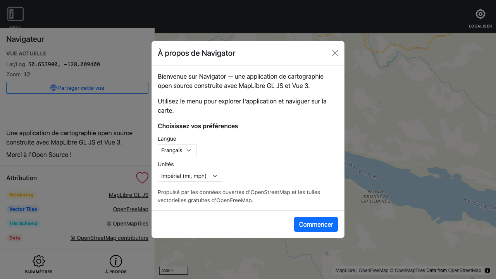
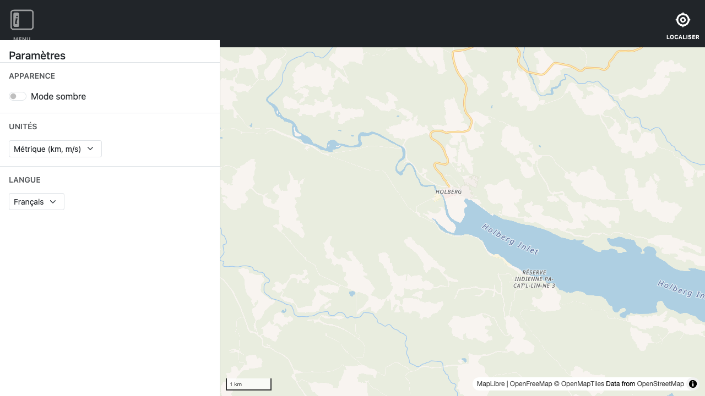
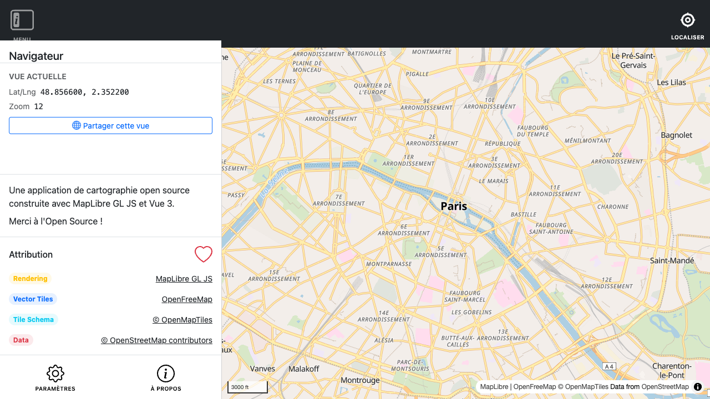

# Locale

Navigator includes built-in multi-language support. The active language is detected automatically from the browser, with an English fallback. Library consumers can supply a default language and override any label via `Navigator.init()`. Users can also change their language in the Settings panel.

---

## Language resolution

The active language is resolved in this order:

1. **Stored user preference** — a language the user has selected in the Settings panel, saved to `localStorage`
2. **Init default** — the `locale` option passed to `Navigator.init()`
3. **Browser language** — `navigator.language`, matched against the available languages; if the exact region code (e.g. `fr-CA`) is not available, the base code (`fr`) is tried
4. **English fallback** — `'en'` is used if no other match is found

---

## `Navigator.init()` options

### `locale`

Sets the default language when the user has no stored preference:

```js
Navigator.init({ id: 'my-map', locale: 'fr' })
```

The About modal on first load renders entirely in the chosen language — labels, buttons, and preference selectors all update immediately:



### `messages`

Overrides individual text labels for any language:

```js
Navigator.init({
  id: 'my-map',
  messages: {
    en: {
      'about.title': 'My Map',
      'about.getStarted': 'Explore',
    },
    fr: {
      'about.title': 'Ma carte',
      'about.getStarted': 'Explorer',
    },
  },
})
```

Custom `messages` are merged on top of the built-in translations — only the keys you supply are overridden.

---

## Available languages

| Code | Language |
|------|----------|
| `en` | English |
| `fr` | Français |

---

## Persistence

The user's language selection is stored in `localStorage` as part of the settings object:

```js
useStorage('settings', { theme: null, units: null, language: null })
```

Storage key: `navigator_settings_{instanceId}`

`language: null` means "follow the browser or init default". Once the user selects a language from the Settings panel, an explicit code (`'en'`, `'fr'`, …) is written and used on every subsequent load.

When French is selected, the entire Settings panel re-renders in French — including the language dropdown that shows the active preference:



---

## Composable API — `useLocale()`

```js
import { useLocale } from '@/core/useLocale'

const {
  locale,          // Ref<string>             — active language code, e.g. 'en', 'fr'
  locales,         // string[]                — all available language codes
  localeNames,     // Record<string, string>  — native display names, e.g. { en: 'English', fr: 'Français' }
  mapLanguageTag,  // Ref<string>             — locale code as OSM name:xx suffix, e.g. 'fr'
  t,               // (key: string) => string — translate a key; falls back to English
  setLocale,       // (code: string) => void  — change the active language
} = useLocale()
```

`t(key)` is reactive — template expressions re-evaluate automatically when the locale changes. If a key is missing from the active locale it falls back to the English value; if missing from English too, the key itself is returned so the UI never shows a blank string.

---

## Translation keys

| Key | English |
|-----|---------|
| `nav.menu` | Menu |
| `nav.menuAlerts` | menu has alerts |
| `menu.title` | Navigator |
| `menu.currentView` | Current view |
| `menu.latLng` | Lat/Lng |
| `menu.zoom` | Zoom |
| `menu.shareMyPosition` | Share my position |
| `menu.shareThisView` | Share this view |
| `menu.attribution` | Attribution |
| `menu.locationLost` | Location access lost. |
| `menu.reRequest` | Re-request |
| `menu.compassUnavailable` | Compass unavailable. |
| `menu.settings` | Settings |
| `menu.about` | About |
| `about.title` | About Navigator |
| `about.getStarted` | Get started |
| `settings.title` | Settings |
| `settings.appearance` | Appearance |
| `settings.darkMode` | Dark mode |
| `settings.units` | Units |
| `settings.metric` | Metric (km, m/s) |
| `settings.imperial` | Imperial (mi, mph) |
| `settings.language` | Language |
| `locate.title` | Your location |
| `locate.position` | Position |
| `locate.latLng` | Lat/Lng |
| `locate.accuracy` | Accuracy |
| `locate.speed` | Speed |
| `locate.heading` | Heading |
| `locate.button.locate` | Locate |
| `locate.button.located` | Located |
| `locate.button.following` | Following |
| `locate.button.error` | Error |
| `locate.modal.permissionTitle` | Permission Required |
| `locate.modal.cancel` | Cancel |
| `locate.modal.iUnderstand` | I Understand |
| `locate.modal.deniedTitle` | Location access denied |
| `locate.modal.close` | Close |

---

## Contributing a translation

1. Copy `src/locales/en.json` to `src/locales/{code}.json` where `{code}` is the [BCP 47](https://www.ietf.org/rfc/bcp/bcp47.txt) language subtag (e.g. `de` for German, `pt` for Portuguese).
2. Translate the values. Any untranslated key falls back to English automatically — partial translations are always safe to ship.
3. Add the code to the `LOCALES` map and its native name to `LOCALE_NAMES` in `src/core/useLocale.js`.

No other code changes are required.

> **CJK and script-variant languages:** always use the full BCP 47 subtag as the locale code — `zh-Hans` (Simplified Chinese), `zh-Hant` (Traditional Chinese), `sr-Latn` (Serbian Latin), etc. Never use a bare base code like `zh` that is ambiguous at the script level. This ensures the locale code maps directly to the correct OSM `name:xx` tag.

---

## OSM Multilingual Names

Navigator's locale codes align with the [OpenStreetMap multilingual names convention](https://wiki.openstreetmap.org/wiki/Multilingual_names). OSM stores place names in multiple languages using tags of the form `name:xx`, where `xx` is a BCP 47 language subtag — exactly the same format used by Navigator locale codes.

This means **every Navigator locale code is a valid OSM `name:xx` tag suffix**. No conversion is needed: `'fr'` → `name:fr`, `'zh-Hans'` → `name:zh-Hans`.

Map labels update automatically when the user changes their language. The active language is applied to all symbol layers that render OSM name fields on map load, and again immediately whenever the language changes.



### `mapLanguageTag`

`useLocale()` exposes a `mapLanguageTag` computed ref that returns the locale code formatted for use in OSM `name:xx` lookups. For all current locales this equals `locale.value`. It provides a stable import point for any code that needs to read the map-label language without reaching into locale internals.

```js
const { mapLanguageTag } = useLocale()
// mapLanguageTag.value === 'fr' when locale is French
```

### How it works

On map load, `useMap` applies the following coalesce expression to every symbol layer whose `text-field` references an OSM name property. Layers that render road refs, house numbers, or other non-name fields are left untouched.

```js
[
  'coalesce',
  ['get', 'name:fr'],   // user's preferred language
  ['get', 'name'],      // local / native name
  ['get', 'name:en'],   // English fallback
]
```

The expression is re-applied reactively whenever `mapLanguageTag` changes, so switching languages in the Settings panel updates the map labels immediately without a page reload.

### Adding map-label support to a feature

If a feature needs to read the current map-label language tag (e.g. to query an external geocoder), import `mapLanguageTag` from `useLocale()`:

```js
import { useLocale } from '@/core/useLocale'

const { mapLanguageTag } = useLocale()
// Use mapLanguageTag.value in API calls or MapLibre expressions
```

