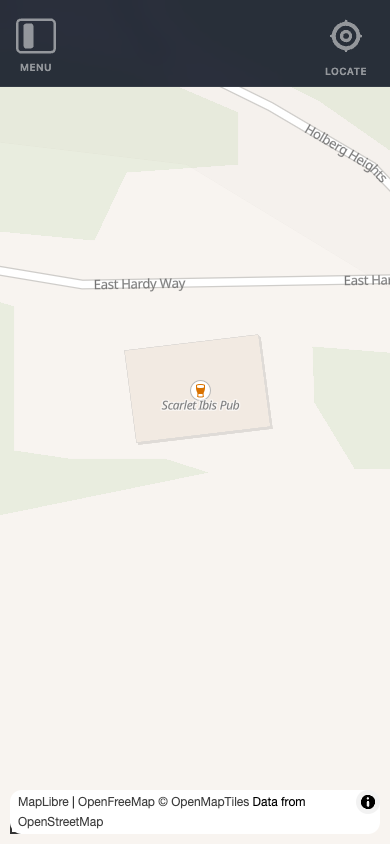
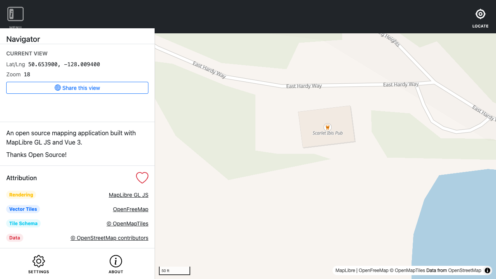

# UI — `useUI`

`useUI` manages all application UI state: responsive breakpoints, the navigation sidebar, and the side panel. It is instance-aware — it scopes its state to the active Navigator instance via `inject('navigatorId')`.

---

## `useUI` — `src/core/useUI.js`

Manages all application UI state: responsive breakpoints, the navigation sidebar, and the side panel.

### Usage

Call `useUI()` from any component's `setup` to access state and actions. State is shared across all components within the same Navigator instance.

```js
import { useUI } from '@/core/useUI';

const { isDesktop, isPanelVisible, openPanel, togglePanel } = useUI();
```

### Responsive breakpoints

`useUI` tracks `window.innerWidth` via a single resize listener (registered once per instance) and exposes three computed breakpoint flags.

| Computed | Type | Condition |
|----------|------|-----------|
| `isDesktop` | `boolean` | `width >= 992px` |
| `isTablet` | `boolean` | `768px ≤ width < 992px` |
| `isMobile` | `boolean` | `width < 768px` |

On resize, `isNavVisible` is automatically managed: it is forced `true` on desktop and hidden on smaller screens if the nav was not explicitly expanded.



### Panel

The side panel displays a single active Vue component at a time. Features open the panel by passing their panel component to `openPanel` or `togglePanel`.

#### `openPanel(id, component)`

Opens the panel with the given component. Closes the mobile nav if open.

```js
import MyPanel from '@/features/my-feature/panel.vue';

openPanel('my-feature', MyPanel);
```

#### `togglePanel(id, component)`

Toggles the panel for the given id:
- If the panel is already open with the same id, it is closed.
- If a different id is provided, the panel switches to the new component.
- On mobile, always opens (never toggles closed).

```js
// Typically called from a top-bar button
togglePanel('my-feature', MyPanel);
```

#### `closePanel()`

Closes the panel without changing the active component.



### Full API

#### State (refs)

| Name | Type | Description |
|------|------|-------------|
| `width` | `number` | Current `window.innerWidth` |
| `isNavVisible` | `boolean` | Whether the navigation sidebar is visible |
| `isNavExpanded` | `boolean` | Whether the nav is in expanded mode |
| `isPanelVisible` | `boolean` | Whether the side panel is open |
| `isPanelExpanded` | `boolean` | Whether the panel is in expanded mode |
| `activePanelId` | `string \| null` | The id of the currently active panel |
| `activePanelComponent` | `Component \| null` | The Vue component rendered in the panel |

#### Computed

| Name | Type | Description |
|------|------|-------------|
| `isDesktop` | `boolean` | `width >= 992px` |
| `isTablet` | `boolean` | `768px ≤ width < 992px` |
| `isMobile` | `boolean` | `width < 768px` |

#### Actions

| Name | Signature | Description |
|------|-----------|-------------|
| `openPanel` | `(id, component)` | Open panel with given component |
| `togglePanel` | `(id, component)` | Toggle panel open/closed or switch component |
| `closePanel` | `()` | Close the panel |
| `togglePanelExpanded` | `()` | Toggle panel expanded state |
| `setPanelExpanded` | `(value)` | Set panel expanded state directly |
| `toggleNav` | `()` | Toggle navigation sidebar |
| `closeNav` | `()` | Close navigation sidebar |
| `setNavExpanded` | `(value)` | Set nav expanded state directly |
